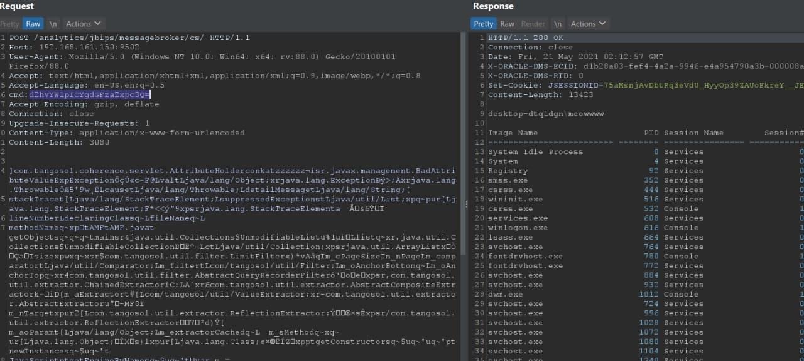
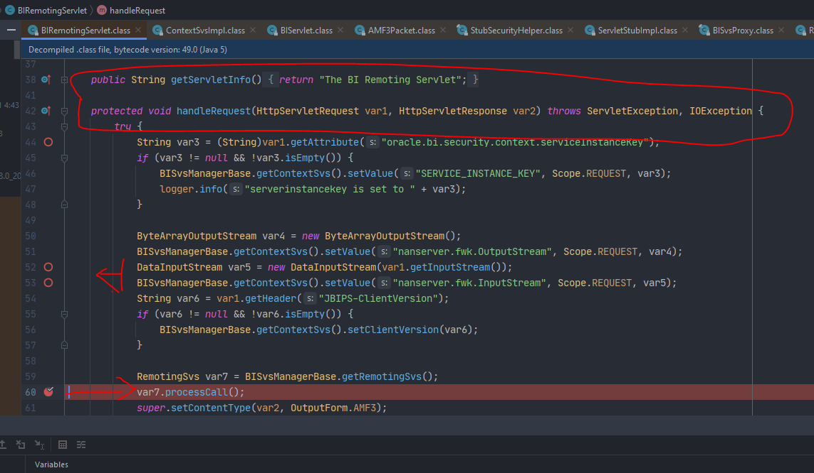
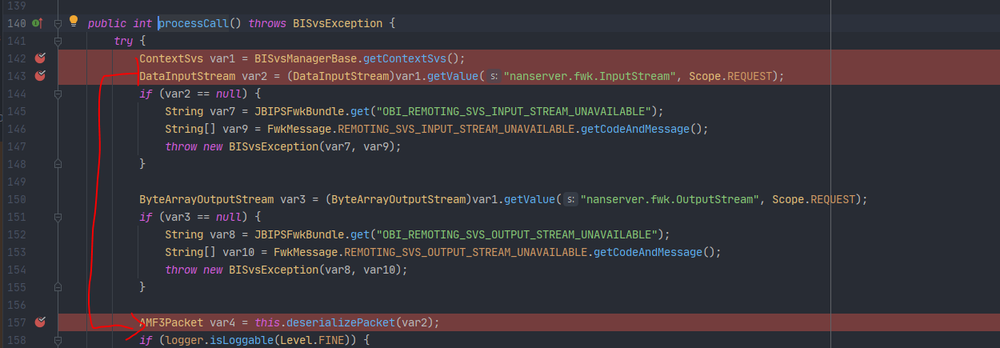
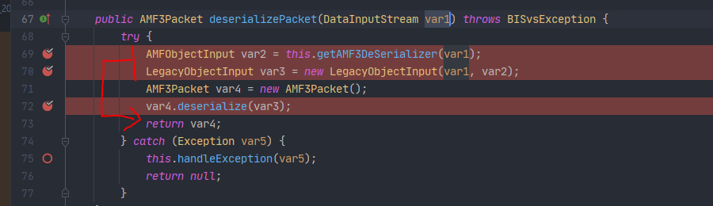
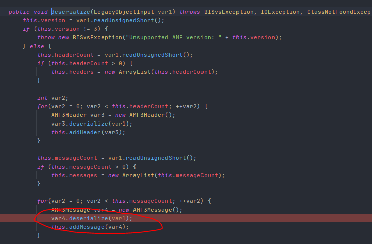
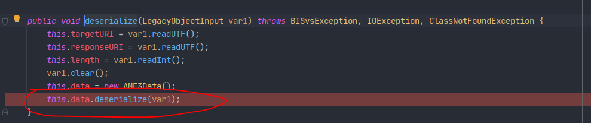
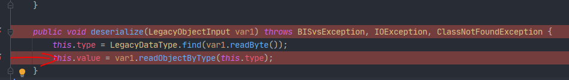
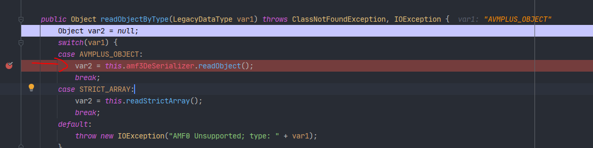
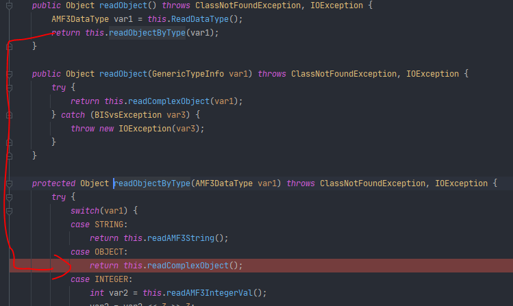
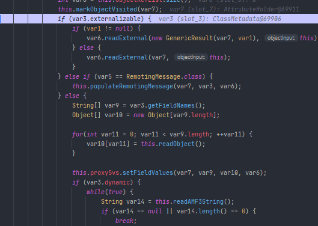

# Oracle-BI (CVE-2020-2950) 

## AMF deseiralize

> **Version:**  5.5.0.0.0, 11.1.1.9.0, 12.2.1.3.0
>
> **Install:**https://www.sql.edu.vn/obiee/oracle-business-intelligence-12c/
>
> **Ref:** https://peterjson.medium.com/cve-2020-2950-turning-amf-deserialize-bug-to-java-deserialize-bug-2984a8542b6f

---

---

## Exploit - PoC

> [amf.bin](https://github.com/tuo4n8/CVE-2020-2950/blob/main/amf.bin)
>
> Header cmd with base64 and child !!

---

## Debug trace bug

URL: `/analytics/jbips/messagebroker/cs/`

- Handle request -> processCall()

- Get inputstream -> deserialize AMF package

- Get Object AMF -> deserilize

- If matching type -> AMF readobject (AMF3DATA.class)

- AMF3DATA.class -> AMF3ObjectInput
- In AMF3ObjectInut -> readComplexObject

- In readComplexObject: 
  - If class deseriliaze is externalizable -> radExternalchain
  - else setFiled

- AMF deserialize  chain -> readExternal Chain

